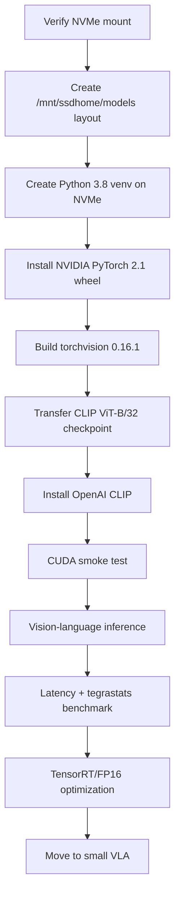

# Deploying a Small VLM and Then a VLA on Jetson AGX Xavier with JetPack 5.1.7

## Executive summary

For **your exact Xavier**, the research changes my earlier recommendation slightly: for the first VLM, I would **not make Docker the primary path**. I recommend a **native Python virtual environment located entirely on the NVMe**.

Your Xavier is running JetPack 5.1.7 / Jetson Linux R35.6.5, Ubuntu 20.04, Python 3.8.10 and CUDA 11.4. NVIDIA specifies JetPack 5.1.7 with **CUDA 11.4.19, cuDNN 8.6.0 and TensorRT 8.5.2**. citeturn17view0turn18view0 NVIDIA publishes an ARM64 PyTorch 2.1 wheel for the JetPack 5 family, and NVIDIA staff demonstrated the exact `torch 2.1.0a0+41361538.nv23.06 + torchvision 0.16.1` combination on a **32 GB Xavier**. citeturn17view2turn20view0

The reason I prefer native installation here is important: NVIDIA's last official `l4t-pytorch` container is `r35.2.1-pth2.0-py3`, while your system is **R35.6.5**. NVIDIA's own NGC documentation says the container L4T tag should match the installed L4T version. There is no official R35.6.5 `l4t-pytorch` image listed. citeturn17view4turn18view3 The native wheel, in contrast, has been explicitly confirmed by NVIDIA staff to work on later JetPack 5.1.x releases including 5.1.4, and JetPack 5.1.7 keeps the same JetPack 5 compute family. citeturn19view0turn17view0

For the first VLM I recommend **OpenAI CLIP ViT-B/32**. It is not a conversational image-captioning model; it is a vision-language encoder that embeds images and text into the same space, making it excellent for proving that image preprocessing, a Transformer, text tokenization, FP16 CUDA inference, and vision-language similarity all work on Xavier. OpenAI requires PyTorch ≥1.7.1, torchvision, `ftfy`, `regex`, and `tqdm`; ViT-B/32 is about 151 million parameters. citeturn17view6turn21search0

The target layout will be:

```text
/mnt/ssdhome/models/
├── checkpoints/
│   └── clip/
│       └── ViT-B-32.pt
├── envs/
│   └── clip-jp5/
├── src/
│   ├── CLIP/
│   └── torchvision-0.16.1/        # removable after installation
├── cache/
│   ├── pip/
│   ├── torch/
│   ├── huggingface/
│   └── xdg/
├── tmp/
├── results/
└── docker-data/                   # only needed if you later use Docker
```

Your existing `/mnt/ssdhome/nvidia` data and the old `ssddocker` partition remain untouched.

The deployment sequence is:



### The compatibility stack I recommend

| Component | Version for your Xavier | Status |
|---|---|---|
| Jetson Linux | R35.6.5 | Already installed |
| Ubuntu | 20.04 | Already installed |
| Architecture | `aarch64` | Already verified |
| Python | 3.8.10 | Already verified |
| CUDA | 11.4.19 / `nvcc` 11.4.315 | JetPack 5.1.7 |
| cuDNN | 8.6.0 | JetPack 5.1.7 |
| TensorRT | 8.5.2 | JetPack 5.1.7 |
| PyTorch | `2.1.0a0+41361538.nv23.06` | NVIDIA Jetson ARM64 wheel |
| torchvision | `0.16.1` | Build from source |
| NumPy | `1.23.5` | Conservative Python 3.8 deployment pin |
| CLIP | OpenAI CLIP source | Official repository |
| CLIP model | `ViT-B/32` | Recommended first VLM |

JetPack component versions are NVIDIA's published versions. citeturn18view0 The PyTorch 2.1 wheel is NVIDIA's JetPack 5 ARM64 build; NVIDIA staff specifically recommends torchvision 0.16.1 with it and demonstrated that combination on a Xavier reporting 30,991 MiB GPU-accessible memory. citeturn17view2turn20view0

One qualification: NVIDIA's static PyTorch compatibility table names JetPack through 5.1.2 for this wheel, rather than explicitly listing 5.1.7. NVIDIA subsequently stated that the wheel is compatible with JetPack 5.1.4 and tested it successfully. Thus this is the **strongest documented late-JetPack-5 configuration I found**, not a separately released "JetPack 5.1.7 PyTorch wheel." citeturn17view2turn19view0

### Native versus Docker on your Xavier

| | Native NVMe environment | NVIDIA `l4t-pytorch` Docker |
|---|---|---|
| My recommendation | **Primary** | Optional/fallback |
| L4T match | Uses host R35.6.5 directly | Official image is R35.2.1 |
| PyTorch | NVIDIA 2.1 Jetson wheel | PyTorch 2.0 |
| torchvision | 0.16.1 source build | 0.14.1 preinstalled |
| Typical settled storage* | ~2–4 GB + model | >5.66 GB image + model |
| Temporary build space* | ~1–3 GB | Little compilation |
| Isolation | Good, via `venv` | Excellent |
| Setup effort | Medium | Low |
| Risk on JP5.1.7 | Low/medium | Medium because L4T tag mismatch |
| Easy removal | Delete venv | Delete container/image |

\*The native figures are planning estimates; we will measure the actual size with `du`. NVIDIA reports the Docker image itself as **5.66 GB compressed**, before local unpacking and writable layers. citeturn18view3

## Compatibility and storage design

Before installing anything, **always verify that `/mnt/ssdhome` is genuinely the NVMe**. Otherwise a missing mount could silently cause downloads to fill your 28 GB eMMC.

### Step 1 — verify the NVMe after every reboot

On Xavier:

```bash
findmnt /mnt/ssdhome
df -hT /mnt/ssdhome
```

Your correct result should contain approximately:

```text
SOURCE             TARGET        FSTYPE
/dev/nvme0n1p2     /mnt/ssdhome  ext4

Filesystem          Size  Used  Avail
/dev/nvme0n1p2      377G  269G   89G
```

Add a hard safety check:

```bash
SOURCE="$(findmnt -n -o SOURCE /mnt/ssdhome)"

if [[ "$SOURCE" != /dev/nvme* ]]; then
    echo "ERROR: /mnt/ssdhome is not mounted from NVMe"
    exit 1
fi

echo "OK: /mnt/ssdhome is on $SOURCE"
```

Do **not continue** unless it says:

```text
OK: /mnt/ssdhome is on /dev/nvme0n1p2
```

### Step 2 — create only the main directories we need

```bash
export MODELS_ROOT=/mnt/ssdhome/models

sudo mkdir -p "$MODELS_ROOT"
sudo mkdir -p "$MODELS_ROOT/envs"
sudo mkdir -p "$MODELS_ROOT/checkpoints/clip"
sudo mkdir -p "$MODELS_ROOT/src"
sudo mkdir -p "$MODELS_ROOT/cache/pip"
sudo mkdir -p "$MODELS_ROOT/cache/torch"
sudo mkdir -p "$MODELS_ROOT/cache/huggingface"
sudo mkdir -p "$MODELS_ROOT/cache/xdg"
sudo mkdir -p "$MODELS_ROOT/tmp"
sudo mkdir -p "$MODELS_ROOT/results"
```

Give your user ownership only of these model-development areas:

```bash
sudo chown -R "$USER":"$USER" \
    "$MODELS_ROOT/envs" \
    "$MODELS_ROOT/checkpoints" \
    "$MODELS_ROOT/src" \
    "$MODELS_ROOT/cache" \
    "$MODELS_ROOT/tmp" \
    "$MODELS_ROOT/results"
```

Do **not** recursively `chown` a future Docker data directory; Docker's internal files should remain root-owned.

### Step 3 — force all temporary files and caches onto NVMe

Create:

```bash
cat > "$MODELS_ROOT/env.sh" <<'EOF'
export MODELS_ROOT=/mnt/ssdhome/models

export PIP_CACHE_DIR=/mnt/ssdhome/models/cache/pip
export TORCH_HOME=/mnt/ssdhome/models/cache/torch
export HF_HOME=/mnt/ssdhome/models/cache/huggingface
export XDG_CACHE_HOME=/mnt/ssdhome/models/cache/xdg
export TMPDIR=/mnt/ssdhome/models/tmp
EOF
```

Load it:

```bash
source /mnt/ssdhome/models/env.sh
```

Verify:

```bash
echo "$MODELS_ROOT"
echo "$TMPDIR"
echo "$TORCH_HOME"
```

The main advantage is that source builds, future Hugging Face downloads and framework caches do not quietly consume the small eMMC.

### Step 4 — transfer models from your Linux workstation instead of downloading twice

On Xavier, ensure SSH is available:

```bash
sudo apt-get update
sudo apt-get install -y openssh-server rsync
sudo systemctl enable --now ssh
```

Then:

```bash
hostname -I
```

Suppose Xavier returns:

```text
192.168.1.50
```

On your **Linux host/workstation**, create a transfer directory:

```bash
mkdir -p ~/jetson-models/clip
cd ~/jetson-models/clip
```

Download the official OpenAI ViT-B/32 checkpoint:

```bash
wget -c \
  -O ViT-B-32.pt \
  'https://openaipublic.azureedge.net/clip/models/40d365715913c9da98579312b702a82c18be219cc2a73407c4526f58eba950af/ViT-B-32.pt'
```

That URL comes directly from OpenAI's CLIP source, and OpenAI embeds the expected SHA-256 hash in the model URL. citeturn17view7

Verify it **on the Linux host**:

```bash
echo '40d365715913c9da98579312b702a82c18be219cc2a73407c4526f58eba950af  ViT-B-32.pt' \
  | sha256sum -c -
```

Expected:

```text
ViT-B-32.pt: OK
```

Transfer it:

```bash
rsync -avh --partial --progress \
  ViT-B-32.pt \
  bimal@192.168.1.50:/mnt/ssdhome/models/checkpoints/clip/
```

Replace `192.168.1.50` with your actual Xavier IP.

On Xavier, verify it again:

```bash
echo '40d365715913c9da98579312b702a82c18be219cc2a73407c4526f58eba950af  /mnt/ssdhome/models/checkpoints/clip/ViT-B-32.pt' \
  | sha256sum -c -
```

This arrangement creates **one checkpoint copy on Xavier**:

```text
/mnt/ssdhome/models/checkpoints/clip/ViT-B-32.pt
```

OpenAI's `clip.load()` supports loading a local checkpoint path, so it will not need to make a second model-cache copy. citeturn17view7

## Recommended native CLIP deployment

This is the route I would actually use on your Xavier.

### Step 5 — install only the small host build dependencies

NVIDIA's Jetson PyTorch guide requires `python3-pip` and `libopenblas-dev`; torchvision source compilation additionally needs JPEG/Python/development libraries. citeturn18view1turn20view0

Run:

```bash
sudo apt-get update

sudo apt-get install -y \
    python3-pip \
    python3-venv \
    python3-dev \
    git \
    wget \
    libopenblas-dev \
    libopenblas-base \
    libjpeg-dev \
    zlib1g-dev \
    libavcodec-dev \
    libavformat-dev \
    libswscale-dev \
    libopenmpi-dev \
    libomp-dev
```

Clean the APT cache afterward to minimize eMMC consumption:

```bash
sudo apt-get clean
```

Check eMMC:

```bash
df -h /
```

### Step 6 — create the Python environment directly on NVMe

```bash
source /mnt/ssdhome/models/env.sh

python3 -m venv /mnt/ssdhome/models/envs/clip-jp5
```

Activate it:

```bash
source /mnt/ssdhome/models/envs/clip-jp5/bin/activate
```

Your prompt should now begin with something like:

```text
(clip-jp5) bimal@ubuntu:~$
```

Verify where Python lives:

```bash
which python
```

Expected:

```text
/mnt/ssdhome/models/envs/clip-jp5/bin/python
```

That is important: the environment itself is now on the NVMe.

Use conservative Python-3.8-compatible build-tool versions:

```bash
python -m pip install --no-cache-dir \
    pip==23.3.2 \
    setuptools==68.2.2 \
    wheel==0.41.3
```

For reproducibility, I would use these application/runtime pins:

```bash
python -m pip install --no-cache-dir \
    numpy==1.23.5 \
    filelock==3.13.1 \
    typing-extensions==4.8.0 \
    sympy==1.12 \
    networkx==3.1 \
    jinja2==3.1.2 \
    MarkupSafe==2.1.3 \
    fsspec==2023.10.0
```

These minor-package versions are **deployment pins chosen to keep a Python 3.8 environment reproducible**, rather than versions NVIDIA specifically mandates. The platform-critical versions are CUDA/cuDNN/TensorRT/PyTorch/torchvision.

### Step 7 — install NVIDIA's CUDA-enabled PyTorch wheel

Do **not** run:

```bash
pip install torch
```

on this Xavier. You specifically want NVIDIA's ARM64 Jetson wheel, because NVIDIA's Jetson packages contain the GPU/cuDNN-enabled build. citeturn17view1

With the environment active:

```bash
python -m pip install --no-cache-dir \
'https://developer.download.nvidia.com/compute/redist/jp/v512/pytorch/torch-2.1.0a0+41361538.nv23.06-cp38-cp38-linux_aarch64.whl'
```

NVIDIA lists this 2.1 build for JetPack 5/Python 3.8 and NVIDIA staff confirmed compatibility with later JetPack 5.1.x. citeturn17view2turn19view0

Immediately test it:

```bash
python - <<'PY'
import sys
import torch

print("Python:", sys.version)
print("PyTorch:", torch.__version__)
print("PyTorch CUDA:", torch.version.cuda)
print("CUDA available:", torch.cuda.is_available())

assert torch.cuda.is_available(), "CUDA is NOT available"

print("GPU:", torch.cuda.get_device_name(0))
print("Compute capability:", torch.cuda.get_device_capability(0))
print("cuDNN:", torch.backends.cudnn.version())

x = torch.randn((1024, 1024), device="cuda")
y = x @ x
torch.cuda.synchronize()

assert torch.isfinite(y).all()
print("PASS: CUDA tensor computation")
PY
```

A healthy installation should look approximately like:

```text
PyTorch: 2.1.0a0+41361538.nv23.06
PyTorch CUDA: 11.4
CUDA available: True
GPU: Xavier
Compute capability: (7, 2)
cuDNN: 8600
PASS: CUDA tensor computation
```

NVIDIA demonstrated the same PyTorch build on Xavier with CUDA enabled. citeturn20view0

**Do not proceed to CLIP if `CUDA available` is `False`.**

### Step 8 — build the matching torchvision

NVIDIA staff's demonstrated JetPack-5/Xavier setup used **torchvision 0.16.1** built from source with this PyTorch 2.1 wheel. citeturn20view0

Clone directly onto NVMe:

```bash
cd /mnt/ssdhome/models/src

git clone \
    --depth 1 \
    --branch v0.16.1 \
    https://github.com/pytorch/vision.git \
    torchvision-0.16.1
```

Enter it:

```bash
cd /mnt/ssdhome/models/src/torchvision-0.16.1
```

Set the build version:

```bash
export BUILD_VERSION=0.16.1
```

Force CUDA support:

```bash
export FORCE_CUDA=1
```

Set compilation only for the GPU architecture PyTorch reports:

```bash
export TORCH_CUDA_ARCH_LIST="$(
python - <<'PY'
import torch
m, n = torch.cuda.get_device_capability()
print(f"{m}.{n}")
PY
)"
```

Check it:

```bash
echo "$TORCH_CUDA_ARCH_LIST"
```

On Xavier it should be:

```text
7.2
```

Now build into the active NVMe virtual environment:

```bash
MAX_JOBS=4 python setup.py install
```

NVIDIA's tested JetPack-5 recipe likewise builds torchvision 0.16.1 from source rather than installing an ordinary PyPI wheel. citeturn20view0

Test both packages:

```bash
python - <<'PY'
import torch
import torchvision

print("torch:", torch.__version__)
print("torchvision:", torchvision.__version__)
print("CUDA:", torch.cuda.is_available())

assert torch.cuda.is_available()

from torchvision.ops import nms

boxes = torch.tensor(
    [[0, 0, 10, 10],
     [1, 1, 9, 9],
     [20, 20, 30, 30]],
    dtype=torch.float32,
    device="cuda",
)
scores = torch.tensor([0.9, 0.8, 0.7], device="cuda")

result = nms(boxes, scores, 0.5)

print("CUDA NMS result:", result.cpu().tolist())
print("PASS: torch + torchvision")
PY
```

This test is more useful than merely importing torchvision because NVIDIA documented cases where torchvision appeared installed but its custom operations had been compiled incorrectly; their recommended fix was rebuilding 0.16.1 with CUDA support. citeturn20view0

### Step 9 — install only CLIP's small dependencies

OpenAI specifies `ftfy`, `regex`, and `tqdm` in addition to PyTorch and torchvision. citeturn17view6

Use conservative Python 3.8 pins:

```bash
python -m pip install --no-cache-dir \
    Pillow==9.5.0 \
    ftfy==6.1.1 \
    regex==2023.10.3 \
    tqdm==4.66.1 \
    packaging==23.2
```

Clone the official CLIP source onto NVMe:

```bash
cd /mnt/ssdhome/models/src

git clone --depth 1 \
    https://github.com/openai/CLIP.git \
    CLIP
```

Record exactly which revision you obtained:

```bash
cd /mnt/ssdhome/models/src/CLIP

git rev-parse HEAD \
    | tee /mnt/ssdhome/models/results/openai-clip-commit.txt
```

Install without allowing pip to replace your carefully selected NVIDIA PyTorch:

```bash
python -m pip install \
    --no-deps \
    -e /mnt/ssdhome/models/src/CLIP
```

This is deliberately **not**:

```bash
pip install torch torchvision
```

because that could replace the Jetson-specific builds.

### Step 10 — perform the first real vision-language inference

Create:

```bash
nano /mnt/ssdhome/models/src/clip_smoke.py
```

Paste:

```python
from pathlib import Path

import clip
import torch
from PIL import Image


CHECKPOINT = Path(
    "/mnt/ssdhome/models/checkpoints/clip/ViT-B-32.pt"
)

if not CHECKPOINT.is_file():
    raise FileNotFoundError(f"Missing checkpoint: {CHECKPOINT}")

device = "cuda" if torch.cuda.is_available() else "cpu"
if device != "cuda":
    raise RuntimeError("CUDA unavailable — do not benchmark on CPU.")

print("Device:", device)
print("PyTorch:", torch.__version__)
print("CUDA runtime:", torch.version.cuda)

# Load the checkpoint from the exact local NVMe path.
model, preprocess = clip.load(
    str(CHECKPOINT),
    device=device,
    jit=False,
)
model.eval()

print("Model dtype:", next(model.parameters()).dtype)

# Synthetic image means this smoke test needs no extra dataset.
image = Image.new("RGB", (512, 512), color=(255, 0, 0))

prompts = [
    "a red image",
    "a blue image",
    "a photo of a dog",
    "a green image",
]

image_tensor = preprocess(image).unsqueeze(0).to(device)
text_tensor = clip.tokenize(prompts).to(device)

with torch.inference_mode():
    image_features = model.encode_image(image_tensor)
    text_features = model.encode_text(text_tensor)

    image_features /= image_features.norm(dim=-1, keepdim=True)
    text_features /= text_features.norm(dim=-1, keepdim=True)

    similarity = 100.0 * image_features @ text_features.T
    probabilities = similarity.softmax(dim=-1)[0].cpu()

print("\nProbabilities:")
for prompt, probability in zip(prompts, probabilities.tolist()):
    print(f"{probability:8.4f}  {prompt}")

assert torch.isfinite(probabilities).all()
assert abs(float(probabilities.sum()) - 1.0) < 1e-3

print("\nPASS: CLIP vision-language inference completed on Xavier GPU")
```

Run:

```bash
source /mnt/ssdhome/models/env.sh
source /mnt/ssdhome/models/envs/clip-jp5/bin/activate

python /mnt/ssdhome/models/src/clip_smoke.py
```

CLIP's official API performs exactly this type of image/text comparison: it preprocesses images, tokenizes text, encodes both modalities and compares the resulting features. citeturn17view6

Once this prints:

```text
PASS: CLIP vision-language inference completed on Xavier GPU
```

you have demonstrated **actual VLM inference**, rather than just proving that CUDA exists.

### Step 11 — test one real photograph

Transfer a photograph from your Linux machine:

```bash
rsync -avh --progress \
    ~/Pictures/test.jpg \
    bimal@192.168.1.50:/mnt/ssdhome/models/
```

Then replace:

```python
image = Image.new("RGB", (512, 512), color=(255, 0, 0))
```

with:

```python
image = Image.open(
    "/mnt/ssdhome/models/test.jpg"
).convert("RGB")
```

and use prompts appropriate to the scene, for example:

```python
prompts = [
    "a chair",
    "a computer monitor",
    "a person",
    "a robot",
]
```

This is closer to the perception workload that will eventually precede robot/action inference.

### Step 12 — inspect actual disk consumption

After installation:

```bash
du -sh /mnt/ssdhome/models/envs/clip-jp5
du -sh /mnt/ssdhome/models/checkpoints/clip
du -sh /mnt/ssdhome/models/src
du -sh /mnt/ssdhome/models/cache
df -hT /mnt/ssdhome
df -h /
```

Once torchvision has passed all tests, you can recover its source/build space:

```bash
rm -rf /mnt/ssdhome/models/src/torchvision-0.16.1
```

Do **not** delete:

```text
/mnt/ssdhome/models/envs/clip-jp5
```

because that contains the installed torchvision package.

A reasonable planning budget is:

| Item | Approximate space |
|---|---:|
| CLIP ViT-B/32 checkpoint | ~0.35 GB |
| OpenAI CLIP source/extras | <0.1 GB |
| NVMe Python environment | roughly 2–4 GB |
| torchvision source/build during installation | roughly 1–3 GB temporary |
| Results/logs | negligible initially |
| Expected native peak | roughly 4–8 GB |
| Official Docker image download alone | 5.66 GB compressed |

The exact native sizes vary with build artifacts, so the `du` measurements above are the figures to trust for your device. NVIDIA's NGC catalog gives the official Docker compressed image size as 5.66 GB. citeturn18view3

## Docker alternative and automation

Docker remains useful later, particularly when running several incompatible research stacks. But for **JetPack 5.1.7/R35.6.5**, there is an important limitation: NVIDIA's official `l4t-pytorch` catalog instructs users to match the image's L4T tag to the host, while the catalog's latest JetPack-5 PyTorch image is `r35.2.1-pth2.0-py3`, containing PyTorch 2.0.0 and torchvision 0.14.1. Your Xavier is R35.6.5. citeturn17view4turn17view5

Therefore I classify the following as an **optional compatibility smoke test**, not the preferred Xavier 5.1.7 environment.

### Docker data must live on NVMe first

Check:

```bash
sudo docker info --format 'Docker root: {{.DockerRootDir}}'
sudo docker system df
```

Before downloading the 5.66 GB image, Docker's root should be:

```text
/mnt/ssdhome/models/docker-data
```

If Docker is still empty, as it was in your earlier screenshots, configure it:

```bash
sudo mkdir -p /mnt/ssdhome/models/docker-data
sudo chown root:root /mnt/ssdhome/models/docker-data
```

Back up Docker configuration:

```bash
if [ -f /etc/docker/daemon.json ]; then
    sudo cp -a \
      /etc/docker/daemon.json \
      /etc/docker/daemon.json.before-models
fi
```

Merge the data root without deleting the NVIDIA runtime settings:

```bash
sudo python3 - <<'PY'
import json
from pathlib import Path

p = Path("/etc/docker/daemon.json")

if p.exists() and p.read_text().strip():
    cfg = json.loads(p.read_text())
else:
    cfg = {}

cfg["data-root"] = "/mnt/ssdhome/models/docker-data"

p.write_text(json.dumps(cfg, indent=2) + "\n")
PY
```

Make Docker depend on the NVMe mount:

```bash
sudo mkdir -p /etc/systemd/system/docker.service.d

printf '[Unit]\nRequiresMountsFor=/mnt/ssdhome\n' \
  | sudo tee \
    /etc/systemd/system/docker.service.d/ssdhome.conf
```

Restart:

```bash
sudo systemctl daemon-reload
sudo systemctl restart docker
```

Verify:

```bash
sudo docker info --format 'Docker root: {{.DockerRootDir}}'
sudo docker info --format 'Runtimes: {{range $name, $runtime := .Runtimes}}{{$name}} {{end}}'
```

You need both:

```text
Docker root: /mnt/ssdhome/models/docker-data
```

and:

```text
nvidia
```

### Pull and test NVIDIA's official image

NVIDIA documents this exact image for L4T R35.2.1 and its included PyTorch/torchvision versions. citeturn17view4

```bash
sudo docker pull \
  nvcr.io/nvidia/l4t-pytorch:r35.2.1-pth2.0-py3
```

Run a one-shot test:

```bash
sudo docker run --rm \
  --runtime nvidia \
  --network host \
  -v /mnt/ssdhome/models:/models \
  -e TORCH_HOME=/models/cache/torch \
  -e HF_HOME=/models/cache/huggingface \
  -e XDG_CACHE_HOME=/models/cache/xdg \
  -w /models \
  nvcr.io/nvidia/l4t-pytorch:r35.2.1-pth2.0-py3 \
  python3 -c 'import torch, torchvision; print(torch.__version__); print(torchvision.__version__); print(torch.cuda.is_available()); print(torch.cuda.get_device_name(0)); x=torch.randn(512,512,device="cuda"); print((x@x).mean())'
```

A failure here would not imply your Xavier GPU is broken; it would more likely indicate that this older L4T container is not sufficiently compatible with R35.6.5. NVIDIA specifically recommends L4T tag matching. citeturn17view4

### Small automation script

This script performs the requested mount check, creates the directory structure, verifies Docker is correctly redirected to SSD, pulls the image and performs a CUDA smoke test.

Save as:

```text
/mnt/ssdhome/models/docker_smoke_test.sh
```

```bash
#!/usr/bin/env bash
set -euo pipefail

ROOT="/mnt/ssdhome/models"
IMAGE="nvcr.io/nvidia/l4t-pytorch:r35.2.1-pth2.0-py3"

echo "== Checking NVMe =="

SOURCE="$(findmnt -n -o SOURCE /mnt/ssdhome || true)"

if [[ "$SOURCE" != /dev/nvme* ]]; then
    echo "ERROR: /mnt/ssdhome is not mounted from NVMe."
    exit 1
fi

echo "NVMe OK: $SOURCE"

echo "== Creating model directories =="

mkdir -p \
    "$ROOT/checkpoints/clip" \
    "$ROOT/src" \
    "$ROOT/cache/torch" \
    "$ROOT/cache/huggingface" \
    "$ROOT/cache/xdg" \
    "$ROOT/results"

echo "== Checking Docker data-root =="

DOCKER_ROOT="$(sudo docker info --format '{{.DockerRootDir}}')"

if [[ "$DOCKER_ROOT" != "$ROOT/docker-data" ]]; then
    echo "ERROR: Docker is using:"
    echo "  $DOCKER_ROOT"
    echo
    echo "Expected:"
    echo "  $ROOT/docker-data"
    echo
    echo "Refusing to pull a large image onto eMMC."
    exit 2
fi

echo "Docker root OK: $DOCKER_ROOT"

echo "== Pulling NVIDIA container =="

sudo docker pull "$IMAGE"

echo "== Testing CUDA =="

sudo docker run --rm \
    --runtime nvidia \
    --network host \
    -v "$ROOT:/models" \
    "$IMAGE" \
    python3 - <<'PY'
import torch
import torchvision

print("torch:", torch.__version__)
print("torchvision:", torchvision.__version__)
print("CUDA:", torch.cuda.is_available())

assert torch.cuda.is_available()

print("GPU:", torch.cuda.get_device_name(0))

x = torch.randn(1024, 1024, device="cuda")
y = x @ x
torch.cuda.synchronize()

assert torch.isfinite(y).all()

print("PASS")
PY
```

Make executable:

```bash
chmod +x /mnt/ssdhome/models/docker_smoke_test.sh
```

Run:

```bash
/mnt/ssdhome/models/docker_smoke_test.sh
```

For this project, however, **I would complete the native CLIP route first and leave Docker alone** unless we encounter a dependency that truly requires it.

## Measuring latency and resource use

Researchers comparing edge models generally separate **GPU kernel/model latency** from **application end-to-end latency**. CUDA execution is asynchronous, so naïvely surrounding a PyTorch call with `time.time()` can under-report GPU execution. CUDA events and explicit synchronization are the correct mechanisms for model-only GPU timing. citeturn17view8

For robotics, measure at least:

1. image encoder GPU latency;
2. text encoder latency;
3. complete CLIP similarity inference;
4. CPU image preprocessing + CPU-to-GPU transfer + inference;
5. batch size 1 first;
6. memory, GPU utilization, clocks and thermals simultaneously.

Batch size **1** is the most important number for a future robot control loop; larger batches tell you throughput but can hide response latency.

### Put Xavier into a reproducible benchmarking state

First inspect the current power mode:

```bash
sudo nvpmodel -q --verbose
```

Then, for benchmarking, maximize Xavier clocks:

```bash
sudo jetson_clocks
```

NVIDIA documents `jetson_clocks` as setting Xavier's CPU, GPU and EMC to their static maximum frequencies, which is useful for reducing clock-scaling noise between benchmark runs. citeturn17view10

Do not change the `nvpmodel` mode number blindly; different Xavier configurations can expose different mode tables.

### Monitor the device while inference runs

Terminal A:

```bash
sudo tegrastats --interval 500
```

`tegrastats` is NVIDIA's native Jetson monitor for processor and memory utilization. citeturn17view9

For a saved log:

```bash
sudo tegrastats \
  --interval 500 \
  --logfile /mnt/ssdhome/models/results/clip_tegrastats.log &
```

Save the PID:

```bash
echo $! > /mnt/ssdhome/models/results/tegrastats.pid
```

After benchmarking:

```bash
sudo kill "$(cat /mnt/ssdhome/models/results/tegrastats.pid)"
```

On Xavier, watch especially:

```text
RAM
SWAP
CPU
GR3D_FREQ
EMC_FREQ
GPU temperature
power rails
```

If swap starts increasing substantially during inference, the latency measurement should not be treated as a normal steady-state model result.

### Benchmark the GPU encoder correctly

Create:

```bash
nano /mnt/ssdhome/models/src/benchmark_clip.py
```

Paste:

```python
import statistics
import time

import clip
import torch
from PIL import Image


CHECKPOINT = "/mnt/ssdhome/models/checkpoints/clip/ViT-B-32.pt"
DEVICE = "cuda"
WARMUP = 20
RUNS = 100


if not torch.cuda.is_available():
    raise RuntimeError("CUDA unavailable")

model, preprocess = clip.load(
    CHECKPOINT,
    device=DEVICE,
    jit=False,
)
model.eval()

pil_image = Image.new(
    "RGB",
    (512, 512),
    color=(120, 80, 50),
)

image = preprocess(pil_image).unsqueeze(0).to(DEVICE)

texts = clip.tokenize(
    [
        "a robot",
        "a table",
        "a computer",
        "a vehicle",
    ]
).to(DEVICE)


# Pre-compute text embeddings when prompts remain fixed.
with torch.inference_mode():
    text_features = model.encode_text(texts)
    text_features /= text_features.norm(
        dim=-1, keepdim=True
    )


# Warmup.
with torch.inference_mode():
    for _ in range(WARMUP):
        _ = model.encode_image(image)

torch.cuda.synchronize()


# GPU-only image encoder timing using CUDA events.
pairs = []

with torch.inference_mode():
    for _ in range(RUNS):
        start = torch.cuda.Event(enable_timing=True)
        end = torch.cuda.Event(enable_timing=True)

        start.record()
        features = model.encode_image(image)
        end.record()

        pairs.append((start, end))

torch.cuda.synchronize()

gpu_ms = [
    start.elapsed_time(end)
    for start, end in pairs
]

gpu_sorted = sorted(gpu_ms)

p50 = statistics.median(gpu_sorted)
p95 = gpu_sorted[int(0.95 * (len(gpu_sorted) - 1))]


# End-to-end:
# PIL preprocessing + H2D transfer + image encoder + similarity.
e2e_ms = []

with torch.inference_mode():
    for _ in range(WARMUP):
        x = preprocess(pil_image).unsqueeze(0).to(DEVICE)
        features = model.encode_image(x)
        features /= features.norm(dim=-1, keepdim=True)
        _ = 100.0 * features @ text_features.T

torch.cuda.synchronize()

with torch.inference_mode():
    for _ in range(RUNS):
        t0 = time.perf_counter()

        x = preprocess(pil_image).unsqueeze(0).to(DEVICE)

        features = model.encode_image(x)
        features /= features.norm(dim=-1, keepdim=True)

        logits = 100.0 * features @ text_features.T

        torch.cuda.synchronize()

        t1 = time.perf_counter()

        e2e_ms.append((t1 - t0) * 1000.0)


print()
print("CLIP ViT-B/32 — Jetson benchmark")
print("---------------------------------")
print(f"Warmup iterations: {WARMUP}")
print(f"Measured iterations: {RUNS}")
print()

print("GPU image encoder:")
print(f"  mean : {statistics.mean(gpu_ms):.3f} ms")
print(f"  p50  : {p50:.3f} ms")
print(f"  p95  : {p95:.3f} ms")
print()

print("End-to-end:")
print(f"  mean : {statistics.mean(e2e_ms):.3f} ms")
print(f"  p50  : {statistics.median(e2e_ms):.3f} ms")
print(
    f"  p95  : "
    f"{sorted(e2e_ms)[int(0.95*(len(e2e_ms)-1))]:.3f} ms"
)

print()
print(
    "Peak CUDA allocation:",
    round(torch.cuda.max_memory_allocated() / 1024**2, 1),
    "MiB",
)
```

Run:

```bash
source /mnt/ssdhome/models/env.sh
source /mnt/ssdhome/models/envs/clip-jp5/bin/activate

python /mnt/ssdhome/models/src/benchmark_clip.py \
  | tee /mnt/ssdhome/models/results/clip_benchmark.txt
```

The important metric for a future VLA perception loop is:

```text
End-to-end p50 / p95 at batch 1
```

not merely the fastest isolated kernel.

### What latency should you expect?

I would **not give you a fake "CLIP on Xavier = X ms" number**. I did not find a sufficiently rigorous primary-source benchmark of the exact OpenAI **CLIP ViT-B/32 + AGX Xavier + JetPack 5** configuration that I would trust as a reference result.

A related edge-transformer study reports **40.7 ms average inference on AGX Xavier** and approximately **2,344 MiB peak memory** for its MobileViT-based workload. That establishes that transformer-family vision inference in the tens-of-milliseconds regime has been demonstrated on Xavier, but it is **not a CLIP ViT-B/32 result and must not be used as a direct expected latency**. citeturn17view11 CLIP ViT-B/32 itself is approximately 151M parameters and contains both vision and text Transformer components. citeturn21search0

For that reason, your first 100-run benchmark should become **our Xavier baseline**. Record:

```text
Power mode
jetson_clocks state
PyTorch version
torchvision version
CUDA version
batch
input resolution
dtype
GPU-only p50
GPU-only p95
end-to-end p50
end-to-end p95
peak CUDA allocation
RAM peak
GR3D utilization
temperature
```

That is the research-grade way to compare later PyTorch FP16, ONNX/TensorRT FP16 and TensorRT INT8 versions.

### Benchmark batches separately

After batch 1 works, test:

```text
batch = 1
batch = 2
batch = 4
```

For a robot, optimize **batch-1 latency first**. Batch 4 may improve images-per-second while making each control decision slower.

### Then optimize, rather than optimizing prematurely

JetPack 5.1.7 already supplies TensorRT 8.5.2, which NVIDIA describes as its inference optimizer/runtime on top of CUDA. citeturn18view0 The sensible progression is:

```text
PyTorch FP16 baseline
        ↓
verify numerical similarity
        ↓
export image encoder
        ↓
ONNX
        ↓
TensorRT FP16
        ↓
benchmark
        ↓
consider INT8 calibration
```

Do **not** start with INT8. First establish correct PyTorch output and FP16 latency so you have a reference against which optimization-induced numerical differences can be measured.

## From VLM to VLA: Alpamayo feasibility

The model you called "ALAPMAYO" is NVIDIA **Alpamayo**.

There is a major distinction between "can theoretically be loaded into approximately 32 GB of shared Xavier memory" and "is a sensible real-time Xavier deployment."

### Alpamayo is not a small Xavier VLA

NVIDIA Alpamayo 1 Nano is a **10B-parameter reasoning VLA**. NVIDIA describes it as an 8.2B Cosmos-Reason backbone plus a 2.3B diffusion-based action expert, processing multi-camera driving input and producing trajectories plus Chain-of-Causation reasoning. NVIDIA's repository requires **Python 3.12.x and an NVIDIA GPU with at least 24 GB VRAM**; its inference download is about **22 GB of weights**. citeturn15view2turn16view0

That directly conflicts with your clean JetPack-5 environment:

```text
Your Xavier:
Python 3.8.10
CUDA 11.4
PyTorch 2.1-class Jetson stack

Current Alpamayo:
Python 3.12
modern software stack
~22 GB model
≥24 GB GPU-memory recommendation
multi-camera video
VLM + diffusion action expert
```

NVIDIA explicitly warns that GPUs below 24 GB are likely to OOM, and an independent 2026 systems study measured the Alpamayo-R1-10B memory requirement at **21.52 GB** before solving memory pressure with layer swapping on a 16 GB discrete GPU. citeturn16view0turn15view6

Your 32 GB Xavier is unusual because CPU and GPU share physical system DRAM. Pure capacity therefore does not make Alpamayo categorically impossible, but after allocating approximately 22 GB of model state there is limited room for the Ubuntu desktop, PyTorch runtime, four-camera tensors, KV cache, activations, trajectory expert and other processes. More importantly, Xavier's compute and memory bandwidth are far below the modern hardware targeted by the Alpamayo software stack. This makes direct Alpamayo PyTorch inference a poor engineering target for this board. That conclusion is an inference from NVIDIA's stated memory/software requirements and your measured Xavier configuration. citeturn16view0turn15view2

### Do not interpret the Alpamayo paper's 99 ms as Xavier latency

The Alpamayo-R1 paper reports **99 ms on-vehicle latency**, but it does not establish that latency on Jetson AGX Xavier. citeturn15view1 It would therefore be incorrect to tell you that Xavier should run Alpamayo in roughly 99 ms.

NVIDIA's current optimized TensorRT Edge-LLM recipe is another clue: the official Alpamayo deployment documentation exports the VLM, visual encoder and action expert separately, supports FP16 for the Alpamayo export, and explicitly describes building/running those engines on a **Thor device**, not Xavier. citeturn15view3turn16view6

So the realistic verdict is:

| Model | Xavier feasibility | Recommendation |
|---|---|---|
| CLIP ViT-B/32 | **Excellent first target** | Do now |
| SmolVLA 450M | Memory size attractive | Later, after compatibility work |
| ~0.5–1B custom/student VLA | Plausible with FP16/TensorRT | Strong long-term Xavier target |
| Alpamayo 1 Nano 10B | Marginal memory, severe software/compute mismatch | **Do not target directly** |
| Alpamayo 2 Super 34B | Not realistic | Teacher/server only |

### SmolVLA is a much more appropriate size class

Hugging Face's SmolVLA is only **450M parameters**, and its authors designed it for lightweight robotics, including asynchronous inference that they report as delivering 30% faster response and roughly 2× task throughput. citeturn15view5

Unfortunately, its **current** LeRobot software stack is now too new for your native JetPack 5 environment: LeRobot 0.6.2 requires Python ≥3.12, PyTorch ≥2.7 and torchvision ≥0.22, while your documented Xavier PyTorch route is Python 3.8/PyTorch 2.1/torchvision 0.16.1. citeturn16view4turn17view2

Therefore I would not blindly run:

```bash
pip install lerobot
```

on your Xavier.

Instead, the professional deployment strategy is:

```text
Modern x86 workstation
        │
        ├── load/train/fine-tune VLA
        │
        ├── freeze model
        │
        ├── export deployable subgraphs
        │
        └── validate reference outputs
                 │
                 ▼
         ONNX / optimized format
                 │
                 ▼
       Jetson Xavier TensorRT
                 │
                 ├── FP16 first
                 ├── batch 1
                 ├── smaller visual tokens
                 ├── action chunking
                 └── INT8 where validated
```

This separates **training-framework compatibility** from **inference-runtime compatibility**.

### Alpamayo should be a teacher, not the Xavier runtime

NVIDIA itself describes larger Alpamayo models as teacher models for **distillation and quantization into student models that meet on-vehicle latency requirements**. citeturn15view2 That is exactly the architecture I would adopt for Xavier:

```text
Alpamayo / large VLA on workstation
              ↓
        training teacher
              ↓
       distilled policy
      roughly 0.3–1B class
              ↓
       FP16 / INT8 export
              ↓
         AGX Xavier
```

For your hardware, a good deployment budget would be something closer to **hundreds of millions of parameters**, rather than 10 billion.

A future compact robot VLA can also exploit the idea used by SmolVLA: compute action chunks asynchronously so inference does not have to finish synchronously before every individual motor command. citeturn15view5

### Why traditional CPU offloading is unattractive on Xavier

The recent Alpamayo memory-swapping paper achieves a 3.55× improvement over conventional offloading for a 21.52 GB Alpamayo model on an RTX 5070 Ti by carefully moving layers between CPU and discrete-GPU memory. citeturn15view6 Xavier is architecturally different: its CPU and integrated GPU already use the same physical LPDDR memory pool. Consequently, "CPU offload" does not give Xavier a second large pool of physical DRAM in the same way it does on a desktop GPU. NVMe swap could extend virtual memory, but storage-backed parameter paging would be a very poor foundation for a low-latency robot controller. This is an architectural inference from the method in that paper and Xavier's unified-memory design.

Our VLA path should therefore prioritize:

```text
smaller model
    >
FP16
    >
reduced visual-token count
    >
smaller image resolution
    >
action chunking / asynchronous execution
    >
TensorRT conversion
    >
validated INT8
    >
distillation
```

rather than trying to force a 10B VLA into swap.

## Reference priority and deployment decision

The sources I would treat as authoritative, in this order, are:

| Priority | Source | What it establishes |
|---|---|---|
| Highest | NVIDIA JetPack 5.1.7 documentation citeturn17view0turn18view0 | R35.6.5 family, Ubuntu 20.04, CUDA 11.4.19, cuDNN 8.6, TensorRT 8.5.2 |
| Highest | NVIDIA PyTorch for Jetson docs citeturn17view1turn18view1 | Correct Jetson ARM64 PyTorch installation mechanism |
| High | NVIDIA Jetson PyTorch compatibility thread citeturn17view2 | PyTorch 2.1 JetPack-5 wheel |
| High | NVIDIA engineer Xavier test citeturn20view0 | PyTorch 2.1 + torchvision 0.16.1 working on 32 GB Xavier |
| High | NVIDIA later-JP5 Xavier confirmation citeturn19view0 | Same wheel usable on JetPack 5.1.4 |
| High | OpenAI CLIP repository/source citeturn17view6turn17view7 | CLIP dependencies, API and official ViT-B/32 checkpoint |
| High | NVIDIA NGC L4T PyTorch catalog citeturn17view4turn18view3 | Official Docker tag, included versions, 5.66 GB compressed size, L4T matching requirement |
| High | NVIDIA Xavier performance/tegrastats docs citeturn17view9turn17view10 | Correct monitoring and stable-clock benchmarking |
| Research | Alpamayo-R1 paper/repository citeturn15view1turn16view0 | Model architecture, requirements and reported latency |
| Research | NVIDIA Alpamayo recipes / TensorRT Edge-LLM citeturn15view2turn15view3 | Student-model strategy and current optimized deployment direction |
| Research | SmolVLA / LeRobot citeturn15view5turn16view4 | Practical compact-VLA size and current dependency gap |

The **immediate deployment path** I recommend is therefore:

```text
/mnt/ssdhome confirmed mounted
        ↓
/mnt/ssdhome/models created
        ↓
Python 3.8 venv ON NVMe
        ↓
NVIDIA PyTorch
2.1.0a0+41361538.nv23.06
        ↓
torchvision 0.16.1
        ↓
CUDA + torchvision test
        ↓
OpenAI CLIP source
        ↓
ViT-B-32.pt on NVMe
        ↓
CLIP semantic inference
        ↓
100-run batch-1 benchmark
        ↓
tegrastats + memory + latency record
        ↓
TensorRT investigation
        ↓
compact 450M-ish VLA / student VLA
        ↓
real robot integration
```

The most important practical point is that **we should stop after each validation gate rather than installing everything at once**. First establish that the NVIDIA PyTorch wheel returns `CUDA available: True`; then establish torchvision 0.16.1; then CLIP; then latency. That gives us a known-good Xavier baseline from which a small VLA can be engineered without filling the eMMC or contaminating the JetPack system environment.